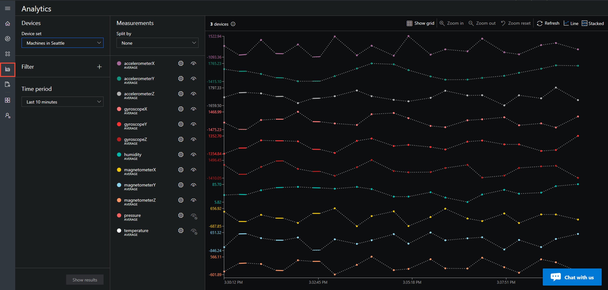
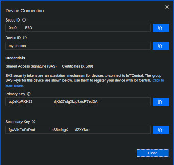
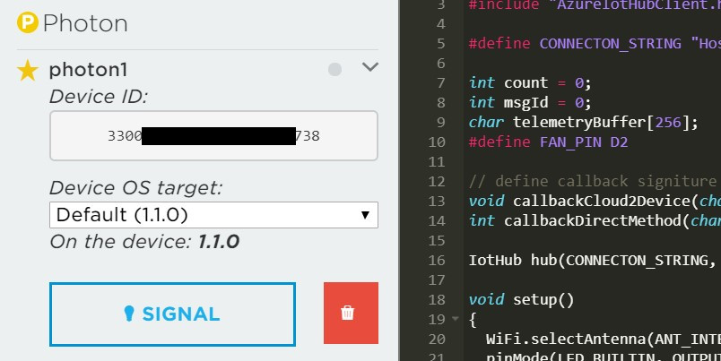

# Connect your Particle Photon Directly to Azure IoT Hub or IoT Central

|Author|[Dave Glover](https://developer.microsoft.com/en-us/advocates/dave-glover), Microsoft Cloud Developer Advocate |
|----|---|
|Documentation|README|
|Platform|[Particle Photon](https://store.particle.io/collections/photon), [Azure IoT Central](https://azure.microsoft.com/en-us/services/iot-central/), [Azure IoT Hub](https://azure.microsoft.com/en-au/services/iot-hub/)|
|Video Training|[What is Azure IoT Central](https://docs.microsoft.com/en-us/azure/iot-central/overview-iot-central), [Introduction to Azure IoT Hub](https://www.youtube.com/watch?v=smuZaZZXKsU)|
|Date|As at Nov 2018|

Now you can connect your Particle Photon to directly to both the Particle Cloud and Azure IoT Hub or Azure IoT Central. The **AzureIoTHubClient** library supports bidirectional messaging, direct methods invocation and soon device twin support.

The Azure IoT Hub Client library can send approximately 50 messages/second to Azure IoT Hub. If you are using the free tier of Azure IoT Hub which allows up to 8000 messages/day then you will reach the limit in just under 3 minutes. So ensure you limit the data publish rate.

Acknowledgment. This IoT Hub Client library depends and builds upon the fantastic [MQTT-TLS](https://github.com/hirotakaster/MQTT-TLS) library.

## What you need

1. [Particle Photon](https://store.particle.io/collections/photon)

2. [Particle Cloud](https://www.particle.io/) Account

3. [A free Azure IoT Central Application](#create-a-free-azure-iot-central-application)

4. If you wish to use an Azure IoT Hub instead of Azure IoT Central, then first create a [Free Azure](https://azure.microsoft.com/free/?WT.mc_id=A261C142F) account, then [Create an Azure IoT Hub (Free Tier)](#creating-an-azure-iot-hub-free-tier)

## Why connect your Particle Photon to Azure Services?

Here are some reasons why you might want to connect your Particle Photon to Azure.

1. You are already using Azure and you want to connect, control and integrate your devices with other business processes.

2. [Azure IoT Central](https://docs.microsoft.com/en-us/azure/iot-central/) (Free 7 day trial or Pay-As-You-Go Free for the first 5 devices) is ready to go, no code required service you can use to chart your device telemetry and control devices. [Find out more about Azure IoT Central](https://youtu.be/G32stXSwtyA)

    

3. You want to learn how to do interesting things with your telemetry such as:-
    * [Weather forecasting using the sensor data from your IoT hub in Azure Machine Learning](https://docs.microsoft.com/en-us/azure/iot-hub/iot-hub-weather-forecast-machine-learning),
    * [Visualize real-time sensor data from your Azure IoT hub by using the Web Apps feature of Azure App Service](https://docs.microsoft.com/en-us/azure/iot-hub/iot-hub-live-data-visualization-in-web-apps),
    * [IoT remote monitoring and notifications with Azure Logic Apps connecting your IoT hub and mailbox](https://docs.microsoft.com/en-us/azure/iot-hub/iot-hub-monitoring-notifications-with-azure-logic-apps).

## How to Connect your Particle to Azure IoT Hub or IoT Central

1. Login to the [Particle Web IDE](https://build.particle.io/build).

2. Click the Libraries icon and type "**AzureIotHubClient**" in the Community Libraries" text box.

    

3. Select the **AzureIotHubClient** library

4. Choose the **AzureIohHub-Full** example

5. Click on "**Use This Example**"

    

6. Create an Azure IoT Central Application

    Watch this 5-minute [screencast](https://youtu.be/D26rJmHyZcA) on how to create the Azure IoT Central Application to chart telemetry and send commands to the Particle Photon.

    To summaries the screencast:-

    1. Create the Azure IoT Central application from [https://azure.microsoft.com/en-au/services/iot-central](https://azure.microsoft.com/en-au/services/iot-central)
    2. Click **Getting Started**
    3. Select Trial, Custom Application, type your application name, click **Create**
    4. Click **Create Device Templates**, name your template eg Particle, click **Create**
    5. Edit the Template, add **Measurements** for Temperature, Humidity, and Pressure telemetry, then click **Done**.
    6. Click **Commands** tab, add commands for "lighton", "lightoff", "fanon", and "fanoff", then click **Done**.
    7. Click **Device Explorer** on the sidebar menu, select the template you just created, the add a **Real Device**
    8. Once you have created your real device click the **Connect** button in the top right-hand corner for the device credentials.

        

    9. You will need these credentials to generate a connection string.

7. Create the Connection String

    You need to generate a connection string for the IoT Central device. You can either:-

      1. Download the [Connection String Generator](https://github.com/Azure/dps-keygen/tree/master/bin) for [Windows](https://github.com/Azure/dps-keygen/tree/master/bin/windows), [macOS](https://github.com/Azure/dps-keygen/tree/master/bin/osx), or [Linux](https://github.com/Azure/dps-keygen/tree/master/bin/linux). The README has the run instructions.
      2. Use my unofficial web-based [Connection String Generator](https://dpsgen.z8.web.core.windows.net/)". No download required.

8. Update the Connection String in the Photon project with the connection string you generated in the previous step.

    Update the connection for your device. See instructions below to obtain an [Azure IoT Hub](#azure-iot-hub-connection-string) or an [Azure IoT Central](#azure-iot-central-connection-string) device connection string.
  
    

9. Set your Particle Photon Firmware to 6.3

    Set the device target firmware to 6.3. Your mileage may vary. I found firmware 6.3 to be more reliable than 7.0. WiFi recovery and 802.11n worked better with 6.3. See [Updating Particle Photon Firmware to 6.3](#updating-particle-photon-firmware-to-63).

      

10. Flash the Particle Photon with Azure IoT Hub Client app your device from the Particle IDE.

## Understanding the AzureIotHubClient Library with examples

The following examples will help you understand how to use the Azure IoT Hub Client library. These examples are simplified versions of the example templates included with the library.

### Example: AzureIotHub-Simple

|API | Description |
|----|-----|
| **hub.loop**   |Should be called frequently as it is responsible for processing inbound messages and methods. It returns true if there is an active connection to Azure IoT Hub or IoT Central.|
| hub.publish |Publishes the telemetry data to Azure IoT Hub or IoT Central. It returns true if successful.|

```c
#define CONNECTON_STRING "< your connection string >"

IotHub hub(CONNECTON_STRING);
count = 0;

setup()
{}

loop()
{
  if (hub.loop())
  {
    if (count++ % 25 == 0)
    {
      hub.publish("\"temperature\":25");
    }
  }
  delay(200);
}
```

### Example: AzureIotHub-Full

|Callbacks | Description |
|----|-----|
| **callbackCloud2Device**   |Function called to process cloud to device messages.|
| **callbackDirectMethod** |Function called when a Direct Method invoked cloud side. Includes added Json payload.|

```c
// define callback signature
void callbackCloud2Device(char *topic, byte *payload, unsigned int length);
int callbackDirectMethod(char *method, byte *payload, unsigned int length);

IotHub hub(CONNECTON_STRING, callbackCloud2Device, callbackDirectMethod);
count = 0;

setup()
{
  RGB.control(true);
}

loop()
{
  if (hub.loop())
  {
    if (count++ % 25 == 0)  // slow down the publish rate to every 25 loops
    {
      hub.publish("\"temperature\":25");
    }
  }
  delay(200);
}

void callbackCloud2Device(char *topic, byte *payload, unsigned int length)
{
  char* msg = (char*)payload;
  if (strncmp(msg, "red", length) == 0)
  {
    RGB.color(255, 0, 0);
  }
}

int callbackDirectMethod(char *method, byte *payload, unsigned int payloadLength)
{
  if (strcmp(method, "lighton") == 0)
  {
    RGB.color(255, 255, 0);
  }
  else
  {
    return 400;
  }
  return 200;
}
```

### Example: Tuning Parameters

|Parameter|Description|
|---------|-----------|
|maxBufferSize| defaults to 500 bytes, make bigger for larger messages.|
|sasExpiryPeriodInSeconds|Defaults to 3600 seconds (60 minute) expiry.|

```c
int maxBufferSize = 500;
time_t sasExpiryPeriodInSeconds = 3600;

IotHub hub(CONNECTON_STRING, callbackCloud2Device, callbackDirectMethod, maxBufferSize, sasExpiryPeriodInSeconds);
```

Passing in turing parameters with no callbacks.

```c
// with no callbacks
IotHub hub(CONNECTON_STRING, NULL, NULL, maxBufferSize, sasExpiryPeriodInSeconds);
```

## Device Connection Strings

### Azure IoT Hub Connection String

### Azure IoT Central Connection String

## Updating Particle Photon Firmware to 6.3

1. Download [v0.6.3 Firmware Release (Photon/P1)](https://github.com/particle-iot/firmware/releases/tag/v0.6.3)

2. Install [Particle CLI](https://docs.particle.io/tutorials/developer-tools/cli/) tools

3. Over the Air (OTA) update your Particle Photon is easiest if your device is already connected to the Particle Cloud. For more information see [Upgrading and downgrading Particle Device OS](https://community.particle.io/t/upgrading-and-downgrading-particle-device-os/43660).

4. If **upgrading** to firmware 6.3
    ```bash
    particle flash <your device id> system-part1-0.6.3-photon.bin
    particle flash <your device id> system-part2-0.6.3-photon.bin
    ```
5. If **downgrading** to firmware 6.3 (reverse order)
    ```bash
    particle flash <your device id> system-part2-0.6.3-photon.bin
    particle flash <your device id> system-part1-0.6.3-photon.bin
    ```

## Creating an Azure IoT Hub (Free Tier)

[Create an Azure IoT Hub (free tier) using the Azure portal](https://docs.microsoft.com/en-us/azure/iot-hub/iot-hub-create-through-portal)

## Create a free Azure IoT Central Application

[Azure IoT Central Application (Free 7 day trial or Pay-As-You-Go Free for the first 5 devices)](https://azure.microsoft.com/en-au/services/iot-central/)