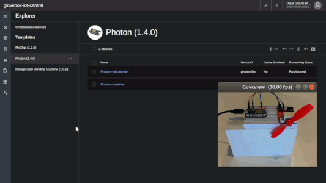
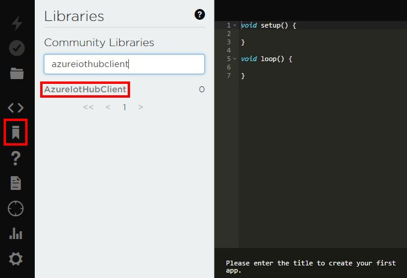
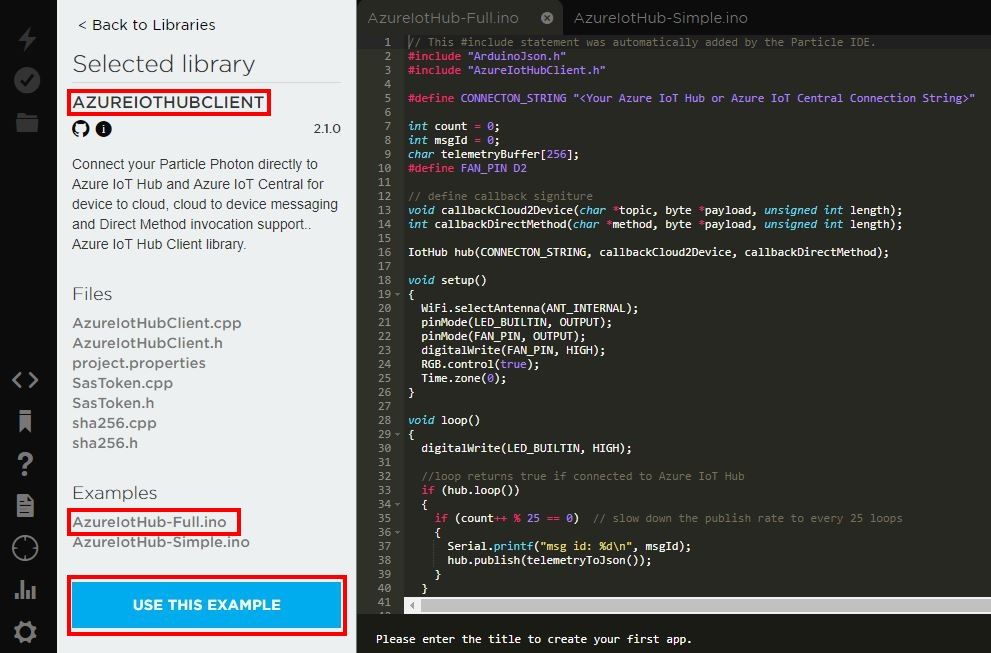
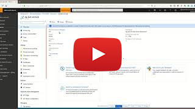

# Connect your Particle Photon directly to Azure IoT Hub or IoT Central

|Author|[Dave Glover](https://developer.microsoft.com/en-us/advocates/dave-glover), Microsoft Cloud Developer Advocate |
|----|---|
|Documentation|[README](https://github.com/gloveboxes/Connecting-Particle-Photon-to-Azure-IoT-Hub/blob/master/README.md)|
|Platform|[Particle Photon](https://store.particle.io/collections/photon), [Azure IoT Central](https://docs.microsoft.com/en-us/azure/iot-central/?WT.mc_id=article-github-dglover), [Azure IoT Hub](https://docs.microsoft.com/en-au/azure/iot-hub/?WT.mc_id=article-github-dglover)|
|Video Training|[What is Azure IoT Central](https://docs.microsoft.com/en-us/azure/iot-central/overview-iot-central/?WT.mc_id=article-github-dglover), [Introduction to Azure IoT Hub](https://www.youtube.com/watch?v=smuZaZZXKsU)|
|Screencasts|[How to create the Azure IoT Central Application](https://youtu.be/D26rJmHyZcA), [How to create an Azure IoT Hub](https://youtu.be/lHpUu6wSX40)|
|Date|As at June 2019|
|Acknowledgment|This AzureIoTHubClient library depends and builds upon the fantastic [MQTT-TLS](https://github.com/hirotakaster/MQTT-TLS) library.|

Now you can connect your Particle Photon directly to the Particle Cloud, Azure IoT Hub, and Azure IoT Central. The **AzureIoTHubClient** library supports two-way messaging, [Direct Methods](https://docs.microsoft.com/en-us/azure/iot-hub/iot-hub-devguide-direct-methods/?WT.mc_id=article-github-dglover), and soon [Device Twins](https://docs.microsoft.com/en-us/azure/iot-hub/iot-hub-devguide-device-twins/?WT.mc_id=article-github-dglover).



## Introduction

A Particle Photon using the **AzureIoTHubClient** library can publish **50 messages per second** to Azure IoT Hub. The free tier of Azure IoT Hub limits the number of messages to 8000 per day. At 50 messages per second, you will reach the 8000-message limit in under 3 minutes. So be sure to throttle the telemetry publish rate.

Azure IoT Central is a "no code" service to graph and analysis telemetry, control devices, and trigger other processes. Under the covers, the service uses [Azure IoT Hub](https://azure.microsoft.com/en-au/services/iot-hub/?WT.mc_id=article-github-dglover), [Azure Time Series Insights](https://azure.microsoft.com/en-au/services/time-series-insights/?WT.mc_id=article-github-dglover), and the [Azure IoT Hub Device Provisioning Service](https://docs.microsoft.com/en-us/azure/iot-dps/about-iot-dps/?WT.mc_id=article-github-dglover). Hence this library and documentation apply Azure IoT Hub and Azure IoT Central.

### What you need

1. [Particle Photon](https://store.particle.io/collections/photon)

2. [Particle Cloud Account](https://www.particle.io/)

3. [Azure IoT Central Application]([#create-a-free-azure-iot-central-application](https://azure.microsoft.com/en-gb/services/iot-central/?WT.mc_id=article-github-dglover))
  
    Azure IoT Central is available as a free 7-day trial or as a Pay-As-You-Go (free for the first 5 devices) service.

4. Or you can also use an Azure IoT Hub instead of Azure IoT Central. For more information read how to [Create an Azure IoT Hub (Free Tier - limited to 8000 messages per day)](#creating-an-azure-iot-hub-free-tier).

## Why connect your Particle Photon to Azure Services

Here are some reasons to connect your Particle Photon directly to Azure.

1. Azure IoT Central is perfect if you have limited development skills, time, or budget to bring an IoT project to life.

    

2. You want two-way messaging and direct method invocation from Azure.

3. You are already using Azure and you want to connect, control, and integrate your devices with other business processes.

4. You want to learn how to do interesting things with your telemetry such as:
    - [Weather forecasting using the sensor data from your IoT hub in Azure Machine Learning](https://docs.microsoft.com/en-us/azure/iot-hub/iot-hub-weather-forecast-machine-learning/?WT.mc_id=article-github-dglover),
    - [Visualize real-time sensor data from your Azure IoT hub by using the Web Apps feature of Azure App Service](https://docs.microsoft.com/en-us/azure/iot-hub/iot-hub-live-data-visualization-in-web-apps/?WT.mc_id=article-github-dglover),
    - [IoT remote monitoring and notifications with Azure Logic Apps connecting your IoT hub and mailbox](https://docs.microsoft.com/en-us/azure/iot-hub/iot-hub-monitoring-notifications-with-azure-logic-apps/?WT.mc_id=article-github-dglover).

## How to connect your Particle Photon to IoT Central or Azure IoT Hub

1. Login to the [Particle Web IDE](https://build.particle.io/build).

2. Click the Libraries icon and type "**AzureIotHubClient**" in the Community Libraries" text box.

    

3. Select the **AzureIotHubClient** library

4. Choose the **AzureIotHub-Full** example

5. Click on "**Use This Example**"

    

6. Azure IoT Central or Azure IoT Hub

   For simplicity create an IoT Central application. If you want to connect to Azure IoT Hub then read [how to set up an Azure IoT Hub (Free Tier)](#how-to-set-up-an-azure-iot-hub-free-tier) and skip the next step.

7. Create an Azure IoT Central Application

    Watch this 5-minute [screencast](https://youtu.be/D26rJmHyZcA) on how to create the Azure IoT Central Application to chart telemetry and send commands to your Particle Photon.

    [](https://www.youtube.com/watch?v=D26rJmHyZcA&t=5s)

    To summarize the screencast:

    1. Create an Azure IoT Central application from [https://azure.microsoft.com/en-au/services/iot-central](https://azure.microsoft.com/en-au/services/iot-central). Then click **Get Started**
    2. Select Trial, Custom Application, type your application name. Then click **Create**
    3. Click **Create Device Templates**, name your template, for example, "Particle". Then click **Create**
    4. Edit the Template, add **Measurements** for Temperature, Humidity, and Pressure telemetry.

        |Display Name| Field name     | Units  | Minimum | Maximum | Decimals |
        |------------| -------------- | ------ | ------- | ------- | -------- |
        |Humidity    | humidity       | %      | 0       | 100     | 0        |
        |Temperature | temp           | degC     | -10   | 60      | 0        |
        |Pressure    | pressure       | hPa    | 800     | 1260    | 0        |

        Then click **Done**.
    5. Click **Commands** tab, add commands for "lighton", "lightoff", "fanon", and "fanoff". Then click **Done**.
    6. Click **Device Explorer** on the sidebar menu, select the template you created. Then add a **Real Device**
      
    7. When you have created your real device click the **Connect** button in the top right-hand corner of the screen to display the device credentials. You will need these credentials for the next step.

          

    8. Create an IoT Central Device Connection String

        You need to generate a connection string for the IoT Central device. You can either:
          1. Download the [Connection String Generator](https://github.com/Azure/dps-keygen/tree/master/bin) for [Windows](https://github.com/Azure/dps-keygen/tree/master/bin/windows), [macOS](https://github.com/Azure/dps-keygen/tree/master/bin/osx), or [Linux](https://github.com/Azure/dps-keygen/tree/master/bin/linux). The README has the run instructions.
          2. Or use my unofficial web-based [Connection String Generator](https://dpsgen.z8.web.core.windows.net/)".

### Update the Particle project CONNECTION_STRING

1. Update the CONNECTION_STRING in the Particle Photon project with the connection string you generated in the previous step.

    

### Flash your Particle Photon project

1. Set your Particle Photon Firmware to 1.10

    See [HOW DO I UPGRADE MY FIRMWARE?](https://docs.particle.io/support/troubleshooting/firmware-upgrades/photon/)

    

2. Flash your Particle Photon with Azure IoT Hub Client app your device from the Particle IDE.

## Understanding the AzureIotHubClient Library

The AzureIotHubClient library includes these examples to help you understand its use.

### Example: AzureIotHub-Simple

|API | Description |
|----|-----|
| **hub.loop**   |Call "loop" often as it handles processing of inbound messages and direct methods. It returns true if there is an active connection to Azure IoT Hub or IoT Central.|
| **hub.publish** |Publishes the telemetry to Azure IoT Hub or IoT Central. It returns true if successful.|

```c
#define CONNECTION_STRING "< your connection string >"

IotHub hub(CONNECTION_STRING);
count = 0;

setup()
{}

loop()
{
  if (hub.loop())
  {
    if (count++ % 25 == 0)
    {
      hub.publish("\"temperature\":25");
    }
  }
  delay(200);
}
```

### Example: AzureIotHub-Full

|Callbacks | Description |
|----|-----|
| **callbackCloud2Device**   |This function is called to process Cloud to Device messages.|
| **callbackDirectMethod** |This function is called when a Direct Method (or an Azure IoT Central Command) is invoked cloud side. It includes a JSON payload.|

```c
// define callback signature
void callbackCloud2Device(char *topic, byte *payload, unsigned int length);
int callbackDirectMethod(char *method, byte *payload, unsigned int length);

IotHub hub(CONNECTION_STRING, callbackCloud2Device, callbackDirectMethod);
count = 0;

setup()
{
  RGB.control(true);
}

loop()
{
  if (hub.loop())
  {
    if (count++ % 25 == 0)  // slow down the publish rate to every 25 loops
    {
      hub.publish("\"temperature\":25");
    }
  }
  delay(200);
}

void callbackCloud2Device(char *topic, byte *payload, unsigned int length)
{
  char* msg = (char*)payload;
  if (strncmp(msg, "red", length) == 0)
  {
    RGB.color(255, 0, 0);
  }
}

int callbackDirectMethod(char *method, byte *payload, unsigned int payloadLength)
{
  if (strcmp(method, "lighton") == 0)
  {
    RGB.color(255, 255, 0);
  }
  else
  {
    return 400;
  }
  return 200;
}
```

### Example: Tuning Parameters

|Parameter|Description|
|---------|-----------|
|maxBufferSize| Defaults to 500 bytes. Increase for larger messages.|
|sasExpiryPeriodInSeconds|Defaults to 3600 seconds (60 minutes).|

```c
int maxBufferSize = 500;
time_t sasExpiryPeriodInSeconds = 3600;

IotHub hub(CONNECTION_STRING, callbackCloud2Device, callbackDirectMethod, maxBufferSize, sasExpiryPeriodInSeconds);
```

Passing in tuning parameters with no callbacks.

```c
// with no callbacks
IotHub hub(CONNECTION_STRING, NULL, NULL, maxBufferSize, sasExpiryPeriodInSeconds);
```

## How to set up an Azure IoT Hub (Free Tier)

1. Create a [free Azure Account](https://azure.microsoft.com/en-au/free/).

2. Watch this [screencast](https://youtu.be/lHpUu6wSX40) for an introduction to creating an Azure IoT Hub and an IoT Device.

      [](https://www.youtube.com/watch?v=lHpUu6wSX40)

3. For more information see [Create an Azure IoT Hub (free tier) using the Azure portal](https://docs.microsoft.com/en-us/azure/iot-hub/iot-hub-create-through-portal/?WT.mc_id=article-github-dglover)
